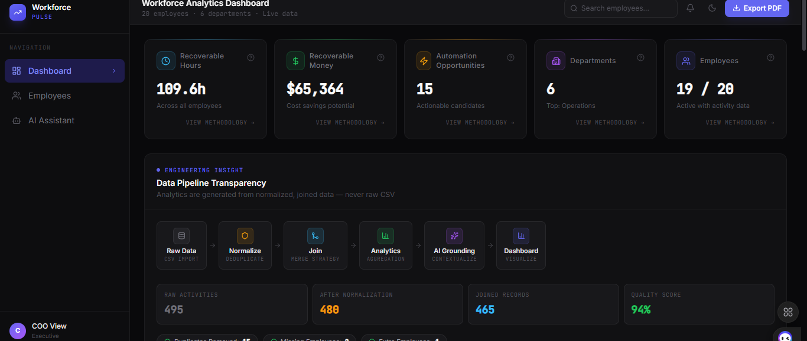

# Workforce Analytics Dashboard Frontend

This is the React frontend for the Workforce Analytics Dashboard. It connects to the deployed Node.js backend and displays workforce analytics, employee drilldowns, AI insights, and PDF export actions.

## Live Backend

```env
VITE_API_URL=https://vibe-coder-ai-task.onrender.com
```

The frontend API client reads `VITE_API_URL` from the environment. If the variable is missing, the code falls back to the live Render backend.

## Features

- Dashboard analytics view
- Department breakdown
- Task breakdown
- Application breakdown
- Automation ranking
- Weekly trend
- Missing employee and data integrity visibility
- Employee drilldown pages
- AI assistant connected to `/api/ai`
- PDF export connected to `/api/export/pdf`

## Tech Stack

- React
- Vite
- TypeScript
- TailwindCSS
- Axios
- TanStack Query
- Recharts
- Framer Motion
- Lucide React

## Local Setup

Install dependencies:

```bash
npm install
```

Create a local `.env` file:

```env
VITE_API_URL=https://vibe-coder-ai-task.onrender.com
```

Run the app:

```bash
npm run dev
```

## API Integration

The frontend calls the backend through `src/api/client.ts`.

```ts
const baseURL = import.meta.env.VITE_API_URL || 'https://vibe-coder-ai-task.onrender.com'
```

Current API endpoints used by the frontend:

- `GET /api/dashboard`
- `GET /api/employees/:employeeId`
- `POST /api/ai`
- `GET /api/export/pdf`

## AI Integration

The UI sends messages in frontend format:

```json
{
  "message": "Which department has the highest automation opportunity?"
}
```

The API adapter converts this to the backend format:

```json
{
  "question": "Which department has the highest automation opportunity?"
}
```

The backend returns `answer`, and the frontend maps it to `response` for the chat UI.

## PDF Export

The frontend calls:

```http
GET /api/export/pdf
```

The response is downloaded as a PDF report generated from live dashboard analytics.

## Vercel Deployment

Use these settings on Vercel:

- Framework Preset: `Vite`
- Build Command: `npm run build`
- Output Directory: `dist`
- Install Command: `npm install`

Add this environment variable in Vercel:

```env
VITE_API_URL=https://vibe-coder-ai-task.onrender.com
```

## SPA Routing

This project uses React Router with `BrowserRouter`. The `vercel.json` file rewrites all routes to `index.html`, so direct refresh works on:

- `/`
- `/employees`
- `/employees/:employeeId`
- `/ai`

## Production Checklist

- `.env` is not committed
- `.env.example` contains only safe placeholder/live public API URL
- API base URL points to the Render backend
- AI request and response shapes are adapted in `src/api/ai.ts`
- PDF export uses the backend `GET /api/export/pdf` route
- Vercel SPA rewrites are configured
- Production build passes with `npm run build`

## UI Walktrough

## Dashboard



## Employee

.png>)

.png>)

## Ai workFlow

.png>)